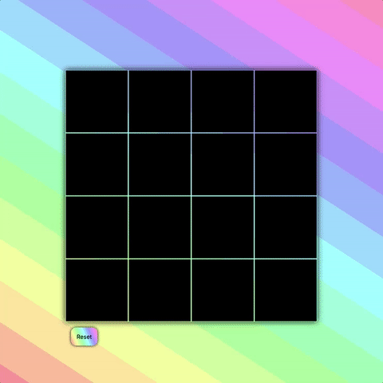

# Game

This is a simple matching game, sometimes called "concentration". Built with HTML, CSS, and 
JavaScript. 

This example shows a few basic JS concepts like: 

- Array 
- Objects 
- Functions

It uses one external library: jQuery. And illustrates a few basic jQuery concepts: 

- Select elements with $()
- addClass()
- removeClass()
- find()
- attr()
- html()

## Challenges 

After working through the comments in the code you can try these challenges. 

- Change the styles. Apply your own styles to the example. 
- Change the matching images. Use your own images. 
- Check for a finished game.
- Add a timer that checks the time taken to complete the game.
- Count the number of clicks to complete the game. 
- Add an option to set the number of squares in the grid. Think of this as levels.

